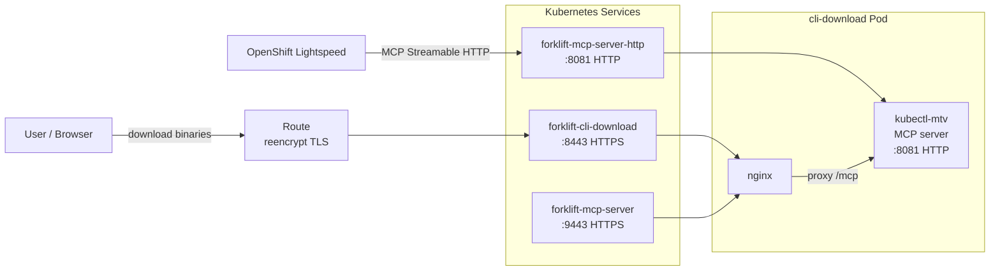

# MCP Server Integration

## Release Signoff Checklist

- [x] Enhancement is `implementable`
- [x] Design details are appropriately documented from clear requirements
- [x] Test plan is defined
- [ ] User-facing documentation is created

## Summary

Embed an MCP (Model Context Protocol) server in the CLI download pod, expose it on dedicated HTTPS and HTTP services, and provide opt-in OpenShift Lightspeed integration so that AI assistants can interact with Forklift to help users plan and execute VM migrations.

## Motivation

AI assistants like OpenShift Lightspeed can help users plan and execute VM migrations, but only if they can communicate with Forklift through a standard protocol. The `kubectl-mtv` CLI already includes a built-in MCP server, but using it with Lightspeed today requires manual pod deployment and OLSConfig patching. Embedding the MCP server in the operator-managed CLI download pod and automating the Lightspeed registration removes this operational burden entirely.

### Goals

- Run the MCP server in the CLI download pod with no additional feature flag
- Expose MCP on dedicated HTTPS and HTTP services, separate from CLI binary downloads
- Provide opt-in Lightspeed integration with automatic registration and cleanup
- Use OpenShift serving certificates for TLS on the HTTPS services

### Non-Goals

- Vanilla Kubernetes support (the CLI download feature is OpenShift-only)
- MCP server authentication beyond user token forwarding via Lightspeed
- Exposing the MCP service externally via a Route (it is cluster-internal only)

## Proposal

### Architecture



The pod runs two processes: the MCP server listening on `0.0.0.0:8081` using the Streamable HTTP transport, and nginx fronting it with two server blocks:

- **Port 8443** -- nginx serves static CLI binaries for download (HTTPS, TLS terminated by nginx)
- **Port 9443** -- nginx reverse-proxies `/mcp` to the MCP server on localhost:8081 (HTTPS, TLS terminated by nginx)
- **Port 8081** -- direct HTTP access to the MCP server process (no TLS)

Three Kubernetes Services back these ports:

| Service | Port | Protocol | Purpose |
|---|---|---|---|
| `forklift-cli-download` | 8443 | HTTPS | CLI binary downloads |
| `forklift-mcp-server` | 9443 | HTTPS | MCP access with TLS |
| `forklift-mcp-server-http` | 8081 | HTTP | MCP access without TLS (used by Lightspeed) |

### MCP Server Tools

The embedded MCP server exposes three tools via the Model Context Protocol:

- **`mtv_read`** -- query Forklift resources (plans, providers, inventory VMs/networks/storage, mappings, health, settings)
- **`mtv_write`** -- create, modify, or delete Forklift resources (providers, plans, mappings, hooks). Disabled when `cli_download_mcp_read_only` is `true`.
- **`mtv_help`** -- get detailed flags, syntax, and examples for any `kubectl-mtv` command

The tool schemas are discovered at startup from `kubectl-mtv help --machine` output and remain static for the lifetime of the pod.

### MCP Services

The MCP server gets two separate Services rather than sharing port 8443 with CLI downloads:

- **`forklift-mcp-server`** (9443 HTTPS) -- uses an OpenShift serving certificate for TLS. Suitable for cluster-internal clients that trust the OpenShift CA.
- **`forklift-mcp-server-http`** (8081 HTTP) -- plain HTTP with no TLS. Used by OpenShift Lightspeed because it currently cannot verify OpenShift-generated serving certificates for cluster-internal services. This means user tokens forwarded by Lightspeed travel unencrypted, but the service is cluster-internal only (see [Security, Risks, and Mitigations](#security-risks-and-mitigations)).

Both are `ClusterIP` services with no external Route. The MCP server starts unconditionally whenever the CLI download pod runs -- no feature flag is needed.

### TLS with OpenShift Serving Certificates

The two HTTPS services use OpenShift's `service.beta.openshift.io/serving-cert-secret-name` annotation. OpenShift generates a TLS Secret per service with a certificate matching its DNS name (`<service>.<namespace>.svc`).

Two separate secrets are mounted into the pod, one for each nginx TLS server block:

| Service | Port | Secret | TLS |
|---|---|---|---|
| `forklift-cli-download` | 8443 | `forklift-cli-download-serving-cert` | Yes |
| `forklift-mcp-server` | 9443 | `forklift-mcp-server-serving-cert` | Yes |
| `forklift-mcp-server-http` | 8081 | -- | No |

The CLI download Route uses `reencrypt` TLS termination since the backend pod terminates TLS on port 8443.

### Container Image

The CLI download container image (`build/forklift-cli-download/Containerfile`) is a multi-stage build:

1. **Build stage** -- compiles all platform binaries for download (`make build-all`) and a native binary for the in-container MCP server
2. **Runtime stage** -- based on `ubi9/nginx-126`, bundles the platform binaries under `/opt/app-root/src/`, installs the native MCP binary at `/usr/local/bin/kubectl-mtv`, and adds a custom `nginx.conf` with the TLS and reverse-proxy configuration

The entrypoint script (`build/forklift-cli-download/entrypoint.sh`) starts the MCP server as a background process and runs nginx in the foreground. A watchdog loop monitors the MCP server PID and terminates the container if the MCP server exits unexpectedly.

### ConsoleCLIDownload

The operator creates a `ConsoleCLIDownload` CR named `kubectl-mtv` so that the OpenShift console UI lists download links for the CLI binary on all supported platforms: Linux amd64/arm64, macOS amd64/arm64, and Windows amd64. The links point at the CLI download Route.

### OpenShift Lightspeed Integration

A new operator setting `feature_lightspeed_integration` (default `false`) controls automatic registration with OpenShift Lightspeed.

#### Enabling

When set to `true` and the `ols.openshift.io` API group is present on the cluster, the operator performs a read-modify-write on the `OLSConfig` singleton CR:

1. Reads the current `OLSConfig` named `cluster`
2. Filters out any existing `kubectl-mtv` entry from `spec.mcpServers` (idempotent re-registration)
3. Ensures `MCPServer` is in `spec.featureGates`
4. Appends the new MCP server entry and applies the result

The resulting OLSConfig spec includes:

```yaml
apiVersion: ols.openshift.io/v1alpha1
kind: OLSConfig
metadata:
  name: cluster
spec:
  featureGates:
    - MCPServer
  mcpServers:
    - name: kubectl-mtv
      url: "http://forklift-mcp-server-http.<namespace>.svc:8081/mcp"
      timeout: 30
      headers:
        - name: Authorization
          valueFrom:
            type: kubernetes
```

Key design points:

- Uses the flat `MCPServerConfig` API (Lightspeed 1.0.10+) with Streamable HTTP transport
- Uses plain HTTP via `forklift-mcp-server-http:8081` to avoid TLS certificate verification issues with cluster-internal serving certificates
- `valueFrom.type: kubernetes` tells Lightspeed to forward the authenticated user's token in the `Authorization` header. The MCP server uses this token for Kubernetes API access, so every operation is scoped to the calling user's RBAC permissions.
- Because Lightspeed cannot verify OpenShift-generated serving certificates for cluster-internal services, the registration uses the plain HTTP service (`forklift-mcp-server-http:8081`). This means the user's bearer token travels unencrypted over the cluster pod network. The risk is mitigated by the fact that the HTTP service is a `ClusterIP` with no Route -- it is reachable only from within the cluster, and inter-pod traffic on the cluster network is already a trust boundary in standard OpenShift deployments.
- The entire registration block uses `ignore_errors: true` so the operator continues gracefully if Lightspeed is not installed or the OLSConfig CR does not exist.

#### Disabling

When `feature_lightspeed_integration` is set back to `false` (or `feature_cli_download` is disabled), the operator performs a read-modify-write to remove only the `kubectl-mtv` entry from the `mcpServers` list, preserving any other MCP server registrations.

#### Uninstall Cleanup

A separate finalize block runs during operator uninstall (when the `ForkliftController` CR is deleted). It performs the same read-modify-write removal of the `kubectl-mtv` entry from OLSConfig, ensuring no stale registration remains after Forklift is removed.

### Operator RBAC

The operator's `ClusterRole` (`manager-role`) includes permissions required for this feature:

| API Group | Resource | Verbs |
|---|---|---|
| `ols.openshift.io` | `olsconfigs` | `get`, `list`, `watch`, `update`, `patch` |
| `console.openshift.io` | `consoleclidownloads` | `*` |

### Operator Settings

These settings are exposed on the `ForkliftController` CR spec and passed as Ansible variables:

| Setting | Default | Description |
|---|---|---|
| `feature_lightspeed_integration` | `false` | Register MCP server with OpenShift Lightspeed |
| `cli_download_mcp_output_format` | `markdown` | MCP response format (`markdown`, `text`, `json`) |
| `cli_download_mcp_max_response_chars` | `0` | Max response size (0 = unlimited) |
| `cli_download_mcp_kube_insecure` | `true` | Skip TLS verify for in-cluster Kubernetes API calls (required because the MCP server uses `--server` + `--token` from HTTP headers, bypassing kubeconfig and its CA bundle) |
| `cli_download_mcp_read_only` | `false` | Disable write operations (`mtv_write` tool not registered) |
| `cli_download_mcp_verbose` | `2` | Verbosity level (0-3) |

### Kubernetes Authentication in HTTP Mode

In HTTP mode, the MCP server supports per-request authentication via HTTP headers:

- `Authorization: Bearer <token>` -- Kubernetes authentication token, passed to kubectl via `--token`
- `X-Kubernetes-Server: <url>` -- Kubernetes API server URL, passed to kubectl via `--server`

Precedence: HTTP headers (per-request) > CLI flags (`--server`/`--token`) > kubeconfig (implicit). Each HTTP POST carries its own headers, so token rotation works seamlessly.

When called through Lightspeed, the `Authorization` header carries the authenticated user's token (forwarded by Lightspeed), and `MCP_KUBE_SERVER` is set to `https://kubernetes.default.svc` by the deployment template.

## Design Details

### Security, Risks, and Mitigations

- **User token forwarding**: The MCP server uses the authenticated user's token (forwarded by Lightspeed) for Kubernetes API access. Every operation is scoped to the calling user's RBAC permissions.
- **HTTP token transport**: The Lightspeed-to-MCP path uses plain HTTP (port 8081) because Lightspeed cannot verify OpenShift-generated serving certificates for cluster-internal services. This means the user's bearer token travels unencrypted over the cluster pod network. The risk is acceptable because the HTTP service is a `ClusterIP` with no Route -- it is reachable only from within the cluster, and inter-pod traffic on the cluster network is already a trust boundary in standard OpenShift deployments. When this CA limitation is resolved in a future Lightspeed release, the registration can be switched to the HTTPS service on port 9443.
- **Cluster-internal only**: The MCP services have no Route. They are only reachable within the cluster via `forklift-mcp-server.<namespace>.svc` (HTTPS) or `forklift-mcp-server-http.<namespace>.svc` (HTTP).
- **TLS on HTTPS ports**: Both port 8443 and 9443 terminate TLS using OpenShift-managed serving certificates.
- **Read-only mode**: The `cli_download_mcp_read_only` setting disables all write operations, limiting the MCP server to read-only queries.
- **Graceful degradation**: Lightspeed integration uses `ignore_errors` throughout, so the operator never blocks reconciliation if Lightspeed is absent or misconfigured.
- **Origin validation**: The MCP server validates the `Origin` header on HTTP requests to prevent cross-origin abuse.

### Test Plan

- Verify the CLI download pod starts with all three ports listening (8443, 9443, 8081)
- Verify TLS works on both 8443 and 9443 from within the cluster
- Verify CLI binary downloads work through the Route
- Verify MCP `/mcp` endpoint responds on port 9443 (Streamable HTTP over HTTPS)
- Verify direct HTTP MCP access works on port 8081
- Verify `mtv_read`, `mtv_write`, and `mtv_help` tools are registered and functional
- With `feature_lightspeed_integration: true`, verify the OLSConfig is patched correctly (featureGates and mcpServers)
- With `feature_lightspeed_integration: false`, verify the `kubectl-mtv` entry is removed from OLSConfig without affecting other entries
- Verify operator uninstall (finalize) cleans up the OLSConfig entry
- Verify `cli_download_mcp_read_only: true` disables the `mtv_write` tool
- Verify the `ConsoleCLIDownload` CR is created with correct download links

### Upgrade / Downgrade Strategy

- **Upgrade**: The CLI download pod gains the MCP server on ports 9443 and 8081. The MCP Services are created automatically. No manual action required.
- **Downgrade**: Rolling back removes the MCP Services. If Lightspeed integration was enabled, the OLSConfig entry should be manually removed:
  ```bash
  oc patch olsconfig cluster --type json \
    -p '[{"op":"remove","path":"/spec/mcpServers"}]'
  ```
